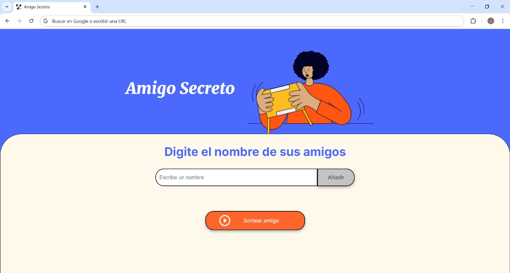

# Challenge Amigo Secreto

El objetivo principal de este desafío es desarrollar habilidades en lógica de programación, por eso hemos proporcionado el HTML y CSS ya preparados. De esta manera, puedes enfocarte exclusivamente en construir la lógica del código JavaScript, aplicando conceptos clave como funciones, arrays, condicionales y variables. Esto te permitirá centrarte en resolver el problema y mejorar el razonamiento lógico, sin preocuparse por la estructura visual del proyecto.

## Pre-requisito

#### Instalar Git

+ Distribuciones Debian
~~~
sudo apt-get install git 
~~~
  
+ Windows

~~~
https://git-scm.com/downloads/win
~~~   

#### Instalar NodeJS
~~~
https://nodejs.org/en/download/package-manager
~~~

## Instalación

1. Abrir Visual Studio Code.
   
2. Clonar repositorio.
   
~~~
git clone https://github.com/JohnCamiloGarzonVargas/ChallengeAmigoSecreto-Oracle.git
~~~

## :earth_africa: Lenguajes:

## :gear: Herramientas:

---

> [!IMPORTANT]
> Iconos para el readme en este repositorio.  
> [Repositorio Iconos](https://github.com/tandpfun/skill-icons)